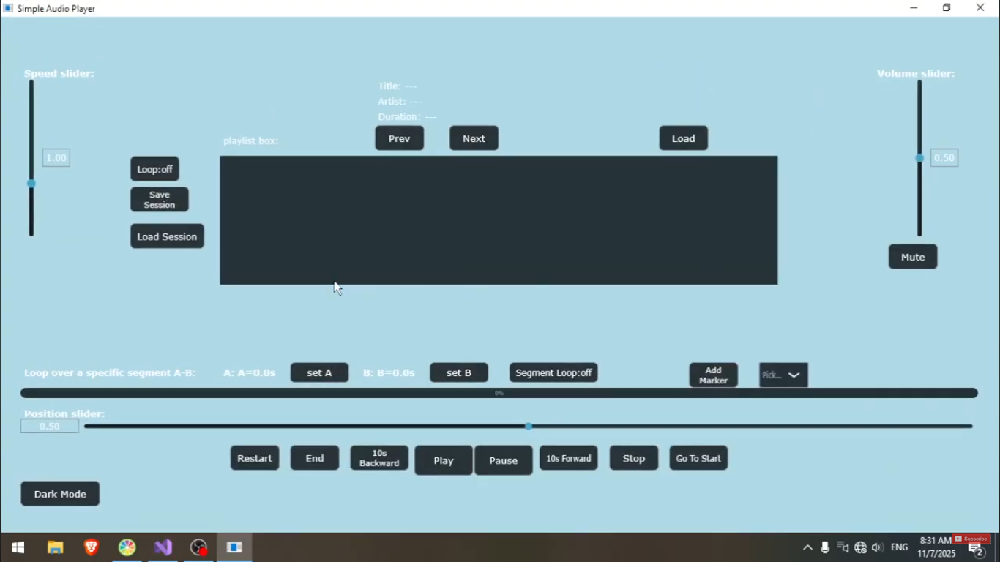
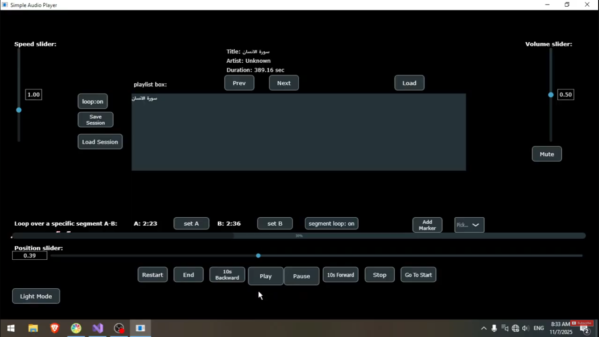

# 🎶 Aiden Audio Player

An advanced, cross-platform audio player built with **C++ and the JUCE framework**, featuring **session management**, **segment looping**, and customizable playback controls. Supports .mp3 and .wav files

<p align="center">
  
  
</p>


## ✨ Features

- 🎧 **Audio Playback** — Play, Pause, Move 10s Backward/Forward, Stop any supported audio file.  
- 💾 **Session Management** — Save and load your current session (tracks, positions, settings).
- ☑️ **Add Markers** — Place multiple markers along your track to save and recall exact playback positions.
- 🕹️ **Playback Controls** 
  - Position slider  
  - Playback speed adjustment  
  - Volume control
- 🎵 **Playlist & Track Metadata** —
Browse and manage your playlist directly within the app. Each selected track displays its Title, Artist, and Duration for quick reference. Seamlessly switch between tracks using **Prev** / **Next** / **Load** controls.
- 🔁 **Looping** 
  - Normal loop (entire track)  
  - Segment loop (select start & end points)  
- 🌓 **Themes** — Light and dark mode switcher for user interface customization.  
- 🎚️ Built using the **JUCE framework** for professional-grade audio and UI handling.


## 🧱 Tech Stack

| Component | Technology |
|------------------|-----------------------------|
| Language         | Modern C++                  |
| Framework        | [JUCE](https://juce.com/)   |
| Build System     | CMake                       |
| OS Compatibility | Windows • macOS • Linux     |

## 🚀 Getting Started

### 1️⃣ Clone the Repository
```bash
git clone https://github.com/tasneemmohsen2/Aiden-AudioPlayer.git
cd Aiden-AudioPlayer
```
### 2️⃣ Get [JUCE](https://juce.com/) And Make Them as Source Files
### 3️⃣ Compile the Files With Your Favorite IDE (Visual Studio Prefered)

# 🤝 Contributions are welcome!
Feel free to open an issue, suggest new features, or submit a pull request to help improve the project.
